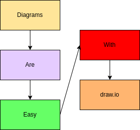
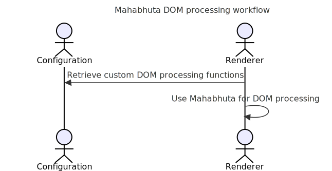
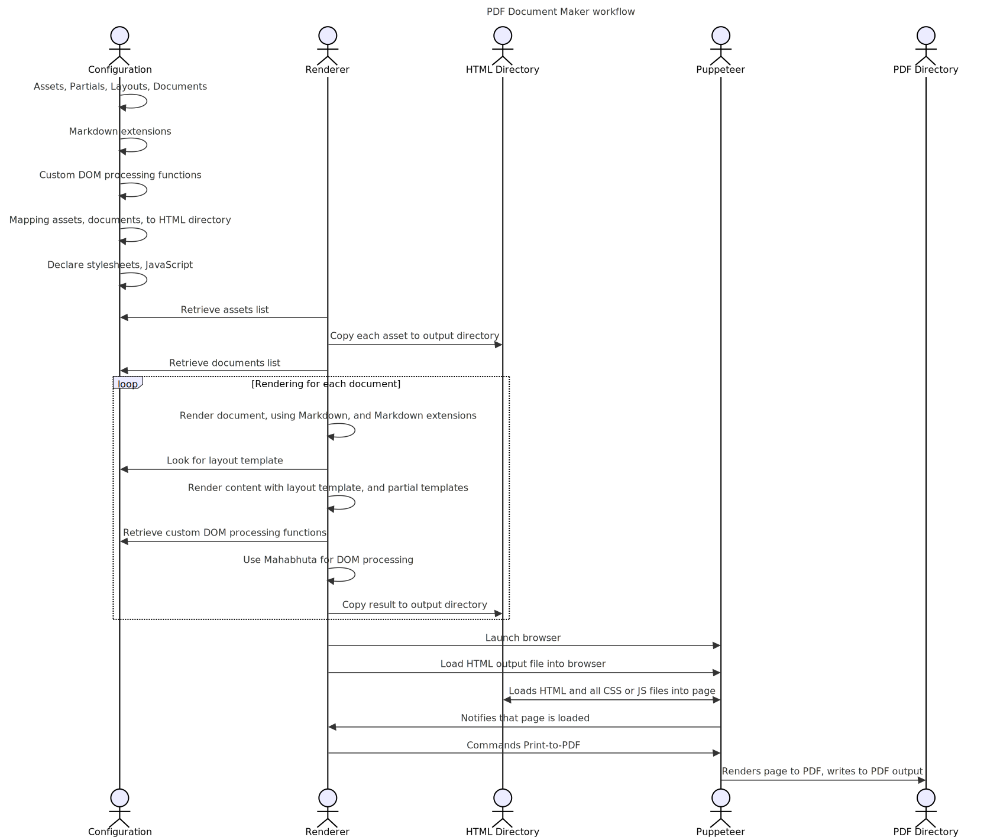

_PDF Document Maker_ is a comprehensive tool for producing good quality PDFs from Markdown or AsciiDoc files.

Under the covers it uses a full-featured static HTML processing system, AkashaCMS, that's designed for producing websites and E-Books.  The HTML is then converted to PDF using Puppeteer.  These capabilities are bundled into an easy-to-use command-line utility with a long list of options.

<toc-text-here></toc-text-here>

# Installation and Project setup for PDF Document Maker

PDF Document Maker runs on the Node.js platform, and is tested with Node.js v20.  It should work for later releases.

A project directory consists of a _package.json_ file which is used for listing dependencies and build processes.  Instead of being used for building Node.js packages, we will use it to record project dependencies and for build scripts.

```shell
$ node --version  # Make sure v20 or later
$ npm init -y     # Set up a default package.json
$ npm install pdf-document-maker --save
```

Once installed you can get help:

```shell
$ npx pdf-document-maker --help
TODO capture current help output
```

The application has a lot of options.  But, most of them have reasonable defaults, and typically you'll use only a few.

# Quick start for using PDF Document Maker

Before going deep into using PDF Document Maker, let's do a quick and easy example.  We will format a test file into a PDF.

The search phrase "_standard markdown test file_" turns up several test Markdown files.  This repository has a very good one:   https://github.com/mxstbr/markdown-test-file

Start by creating a directory, adding a `package.json`, and installing `pdf-document-maker` as shown above.

The GitHub repository for this tool already has this set up in https://github.com/akashacms/pdf-document-construction-set/tree/main/example/simple

In that directory, create a directory named `documents`:

```shell
$ mkdir documents
$ cd documents
$ wget https://...   # Download TEST.md
$ cd ..
```

With a file, `documents/TEST.md`, run this command:

```shell
$ npx pdf-document-maker  \
        --document-dir documents \
        --pdf-output PDF \
        --html-output out \
        --title 'Markdown test document' \
        --format A4 \
        TEST.md
```

This command creates two files:

* `out/TEST.html` - is the HTML intermediate file
* `PDF/TEST.pdf` - is the PDF result

## What did that command do?

A lot happened under the covers:

* A configuration object was built for rendering documents into an HTML output directory.
* The input file was processed and written to the output, as were any assets (CSS etc).
    * This created `out/TEST.html`
* Puppeteer was invoked to print the HTML to PDF.
    * This created `PDF/TEST.pdf`

The directory _documents_ is declared as a place the tool looks for documents.  There can be more than one documents directory.  The underlying system, AkashaCMS, supports four sets of input directories, _assets_, _partials_, _layouts_, and _documents_.

| Type        | Option           | Description |
|-------------|------------------|-------------|
| _assets_    | `--asset-dir`    | Holds unprocessed files like CSS or images |
| _partials_  | `--partial-dir`  | Holds templates for content snippets   |
| _layouts_   | `--layout-dir`   | Holds page layout templates            |
| _documents_ | `--document-dir` | Holds document files                 |

For of the directory types there may be multiple actual directories.  The directories are _stacked_ with the later directories being higher in the stack.  This forms four virtual filesystems and we refer to files using the relative pathname from the root.

In this example there is one documents directory.  The file `documents/TEST.md` has a VPath (Virtual Path) of `TEST.md` which is the path we use on the command line.

There is a default layout directory within PDF Document Maker holding a single layout template, `default.njk`.  If no layout template is specified, that one is used.

# File name conventions

We already discussed how the virtual directory stack works, and that a VPath are path names relative o the root directory(ies).

_Documents_ directories file names have file extensions naming the file type, as is usual practice.  The extension is used to select the rendering package required to process that file.

Name | Extension | Output Ext | Description
-----|-----------|-------------|-------------
AsciiDoc | `.adoc` or `.html.adoc` | `.html` | Supports AsciiDoctor documents
Markdown | `.md` or `.html.md`   | `.html` | Supports Markdown documents
LESS     | `.less` or `.css.less`  | `.css` | Supports compiling LESS files to CSS
EJS      | `.ejs` or `.html.ejs`  | `.html` | EJS
Handlebars | `.handlebars` or `.html.handlebars` | `.html` | Handlebars
JSON     | `.json` or `.html.json` | `.html` | Supports rendering a JSON document through a template to produce HTML
Liquid   | `.liquid` or `.html.liquid` | `.html` | LiquidJS
Nunjucks | `.njk` or `.html.njk`  | `.html` | Nunjucks

In documents directories, files with these extensions are processed by the named rendering engine, then placed in the same VPath (with the new extension) in the HTML output directory.

In partials or layouts directories, files have either extension, and are used while rendering files in the documents directories.  These files are not copied to the HTML output directory.

In assets directories, files are simply copied to the HTML output directory.

# Page layouts

One way PDF Document Maker differs from other Markdown-PDF tools is by supporting the use of a layout template.  Layout templates are responsible for establishing the entire page structure.

The HTML resulting from rendering the Markdown or AsciiDoc is available to the layout template as a variable named _content_.

Consider the default layout template, `default.njk`:

```html
<!doctype html>
<html lang="en">
<head>
<meta charset="utf-8" />
<meta http-equiv="X-UA-Compatible" content="IE=edge,chrome=1" />
<meta name="viewport" content="width=device-width, initial-scale=1.0"/>




<title>{{ title }}</title>
{{ ak_core.stylesheets() }}
{{ ak_core.headerJavaScript() }}
</head>
<body>
<div class="container-fluid" role="main">
<div class="row">
  <!-- include our document's content -->
  <article class="col-md-9">
      {{ content }}
  </article>
</div>
{{ ak_core.footerJavaScript() }}
</body>
</html>
```

This template is derived from ones used for regular websites.  It is in Nunjucks format.

It imports Nunjucks macros from the AkashaCMS _built-in_ and _base_ plugins.  The PDF Document Maker tool is built using AkashaCMS components, which cover a broad range of website or EBook building needs.

In this case we see that lists of CSS stylesheets and JavaScript files can be included in the top of the document (`<head>`) or the bottom of the document.  That's handled by calling a couple functions in the _built-in_ plugin.

Bootstrap classes are used to aid page layout, but can be used for other purposes.

As said earlier, the content from the previous rendering stage is available as the variable _content_. The page title is also available as a variable.

## Partial templates

Partials are typically a small template meant to help format commonly used HTML structures.

For example, each document might have a metadata field (we'll discuss this later) named `publicationDate` which you might want to present somewhere.  In the AkashaCMS Base plugin, the partial `ak_publdate.html.njk` is available for this purpose (in NJK format):

```html

    Date: {{ publicationDate | escape }}

```

This can be invoked by the custom tag

```html
<partial file-name="ak_publdate.html.njk" data-publication-date="Date String"/>
```

There are other methods such as the `<publication-date>` tag, or the `akpublicationdate` extension installed in Nunjucks, both of which invoke this same partial template.

# Document format, and document metadata

We've already discussed three items that are contained in document metadata.

Like many systems, the document format supports YAML frontmatter which turns into the document metadata.

It looks roughly like this:

```yaml
---
title: Gettysburg Address
layout: page.html.ejs
publicationDate: January 7, 2025
otherTag: otherValue
tag42: "The Meaning of Life"
---
This is the content area.
```

The area reading _this is the content area_ is the content body for the document.  The part between the lines of three dashes (`---`) is the frontmatter, and must be in YAML format.

When a document is read, it is first parsed into _body_ (or sometimes _docContent_) and _metadata_ (or sometimes _docMetadata_).

The metadata object is available, as discussed earlier, to templates as "_variables_".  The NJK template snippet, `{{ publicationDate | escape }}`, means to access the metadata variable `publicationDate` and then apply the `escape` filter.

## Default metadata values in PDF Document Maker

As a convenience, PDF Document Maker supports command-line options for two metadata values:

* `--title` supplies the value for `title`, and overrides any existing value
* `--layout` supplies the value for `layout`, and overrides any existing value

## The meaning for certain metadata values

Generally the content metadata is simply data with no other defined purpose.  It is up to the templates used for processing your documents define the purpose of each metadata value.

Some fields do have defined purposes:

* `title` serves as the page title, and might be used in the `<title>` tag as well as in a prominent `<h1>` tag at the top of the page.
* `layout` names the layout template to use with this document.
* `publicationDate` is a date string (it will be parsed by the Date class) on which the document was _published_.

# CSS styles for print

Most of us use CSS for theming web pages shown in a web browser.  We'll create a CSS stylesheet, include it in our web page, and not at all care about the `@media` tag in CSS.

Using `@media` we can target some of our CSS declarations for `screen` display:

```css
@media screen and (min-width: 900px) {
    /* ... */
}
```

This targets regular display screens at least 900px wide.

We might not be aware of the need for specific CSS rules to handle printing.  Printed output has different requirements than screen display.  To produce a good quality PDF/print document we must take this into account.  Doing so starts with this:

```css
@media print {
    /* All your print styles go here */
}
```

What you do is up to you.

To specify stylesheets:

```
--style <cssFile...>        File names of CSS style sheets
--lesscss <lesscssFile...>  File names of LESS files to render to CSS
```

The `--style` parameter is used for regular CSS files.  These can be stored either in an `asset` directory or a `document` directory.  When the document is rendered, the CSS files will be copied unmodified into the HTML output directory.

The `--lesscss` parameter is used for LESS files, which is a format for improved CSS syntax.  These files must be stored in a `document` directory, have an extension of either `.less` or `.css.less`, and are rendered from LESS the format to CSS.

In each case the parameter can be repeated multiple times to handle multiple files.  The pathname must be a complete VPath with a leading slash.

Using the `--style` or `--lesscss` parameter causes a `<link>` tag to be generated in the `<head>` section of the document.

Here are links to articles that are useful for understanding CSS for printing:

* https://www.sitepoint.com/css-printer-friendly-pages/
* https://didoesdigital.com/blog/print-styles/
* https://www.makeuseof.com/format-web-page-for-printer/
* https://www.smashingmagazine.com/2015/01/designing-for-print-with-css/

Support for https://printedcss.com/ is bundled in PDF Document Maker.  It is automatically included in the stylesheet declarations.

If you prefer to disable this, use the `--no-printcss` option.

Some other frameworks for CSS for printing:

* https://github.com/BafS/Gutenberg
* https://github.com/vladocar/Hartija---CSS-Print-Framework?tab=readme-ov-file
* https://github.com/cognitom/paper-css
* https://www.getpapercss.com/

For example to use Gutenberg, start by adding it to your project dependencies:

```shell
$ npm install gutenberg-css --save
```

Then create an asset directory:

```shell
$ mkdir -p assets/vendor/gutenberg
```

It is good practice to use a directory path `/vendor/VENDOR-NAME` to store files sourced from a particular project.

Then copy the Gutenberg CSS into that directory:

```shell
$ cp -r node_modules/gutenberg-css/dist/ assets/vendor/gutenberg/
```

And finally, when running PDF Document Maker we add `--style vendor/gutenberg/dist/gutenberg.css`

```shell
$ npx pdf-document-maker  \
        --document-dir documents \
        --pdf-output PDF \
        --html-output out \
        --title 'Markdown test document' \
        --style vendor/gutenberg/dist/gutenberg.css \
        --format A4 \
        TEST.md
```

# Project configuration with the PDF Document Maker CLI

We discussed earlier that a PDF Document Maker project directory contains the Node.js `package.json` file where one dependency is `pdf-document-maker`.  The directory must also contain the sort of files mentioned earlier.

Most of the project configuration is handled with command-line options.  The `--help` option will show you the full list of options.

The configuration options cover two broad areas:

* Generating HTML from the input files - These options control generation of the AkashaCMS configuration object
* Generating PDF from the HTML - These options control the Puppeteer configuration

## Output directories

Two output directories are created:

Output | Option | Description
-------|--------|-----------------
HTML Output | `--html-output` | This contains the directory structure of HTML, CSS, JavaScript, and images, which will be rendered into the PDF.  The structure is precisely the same as a static website, meaning the files are placed in a directory structure that can be deployed to a regular website.
PDF Output | `--pdf-output` | This contains the PDF file which is generated.

## Header and Footer text in the PDF

A key feature offered by word processing systems like Libre Office is placing text in the margin at the top and bottom of the page.  This header and footer text usually carries a date, page number, copyright statement, and document title.

`--template-header`

`--height-header`

`--template-footer`

`--height-footer`

## Controlling page layout

As we discussed earlier, the `--layout` option lets us specify a page layout template.

Layout templates are stored in the _Layouts Dirs_, which we specify using the `--layout-dir` option.

## Page styling using CSS stylesheets

We can further customize the document presentation using CSS stylesheets.  The design allows us to use any number of stylesheets, and to use the LESS format for creating stylesheets.

For each kind of stylesheet we can repeat the option more than once:

```shell
$ npx pdf-document-maker ... \
    --style assets/style1.css --style assets/style2.css \
    --lesscss assets/style3.less --style assets/style4.less
    ...
```

The filenames are VPaths.  In this example, each of the CSS files are located in the `assets` virtual directory.

For `--style` parameters, the file is expected to be in CSS format, and is simply copied into the HTML output directory.  These files can be either in an _assets_ directory, or _documents_ directory.

For `--lesscss` parameters, the file will be rendered using the LESS processor.  This means the files must have an extension of `.css.less` or `.less`, and be in a _documents_ directory.

Additionally, by default the _PrintCSS_ stylesheet will be used.  This is from an open source project, and is CSS for produces good looking print documents.  This stylesheet can be disabled using the `--no-printcss` option.

Additionally, by default the Bootstrap v4 framework is used.  For the PDF documents most of Bootstrap is not useful.  It has powerful page layout capabilities, and certain components may be useful for creating visual effects.  This framework may be disabled with the `--no-bootstrap` option. 

All stylesheets, whether the default `print.css` file or those specified on the command line, are added to a list.  The page layout template is expected to use either of these methods:

```html
<!-- NJK macro for generating link tags to CSS files -->
{{ ak_core.stylesheets() }}
<!-- a custom HTML tag for the same purpose -->
<ak-stylesheets></ak-stylesheets>
```

Both of these convert the list of stylesheet references into `<link>` tags referencing the stylesheets.

## Markdown extensions supported by PDF Document Maker

The Markdown ecosystem includes a wide variety of extensions, adding additional features to the language.  PDF Document Maker uses the Node.js Markdown IT engine, and can in theory use any of the available plugins.  Several are already bundled into the application, with these effects.

#### Auto-generating "anchor" text for header tags

This extension causes an `id="anchor"` attribute to be added to the HTML header tag like so:

```html
## A Markdown H2 tag
<!-- becomes -->
<h2 id="generated anchor">A Markdown H2 tag</h2>
```

This allows an `<a href="#anchor">Link text</a>` tag to link directly to the header tag.  This would be useful in Tables of Content, where the links would go directly to the section.

This feature can be disabled with `--no-md-anchor`

#### Generating footnote blocks

Allows authors to write footnotes.[^1]  A footnote is referenced with a marker, such as `[^1]`.  The footnote is defined by writing a paragraph like this:

```
[^1]: This is the body of the footnote.
```

The extension sets up internal links between the two points.

[^1]: This is the body of the footnote.

This feature can be disabled with `--no-md-footnote`

#### Adding either id= or class= attributes to HTML

To implement styling using CSS requires the ability to set ID or Class values.  Example:

```
# header {.style-me}
paragraph {data-toggle=modal}
```

The stuff between `{` and `}` are where we list the attributes to add to the rendered HTML tags after.  The above will be converted to:

```html
<h1 class="style-me">header</h1>
<p data-toggle="modal">paragraph</p>
```

The extension allows setting other attributes beyond ID and Class.  But, most other attributes are potential security vulnerabilities.  The extension has been configured to only allow `id=` and `class=` attributes.

Use of these attributes should then correspond to entries in CSS stylesheets.

Be aware that the `-anchors` extension and `-attrs` extension both deal with the `id=` value on headers.  With `-anchors` the author is not in control of the choice for the `id=` value, whereas with the `-attrs` extension the author chooses the `id=` value.

This feature can be disabled with `--no-md-attrs`

#### Simplify adding a `<div>` block

Another way to customize the resulting HTML is to add `<div>` tags with certain attributes.  For example a box with a yellow background and solid brown border could serve to draw attention to some content.  The color effects are easy to define in CSS, and the ability to add a `<div>` gives the opportunity to wrap a contain some content within a box.

Example:

```
::: #warning
*here be dragons*
:::
```

That generates the following:

```html
<div id="warning">
<em>here be dragons</em>
</div>
```

While this is easy to use, one has to consider that Markdown engines like Markdown-IT allow the author to use HTML tags.  It's therefore easy to add `<div>` tags without requiring a Markdown extension.

This feature can be disabled with `--no-md-div`

#### Adding `<section>` tags corresponding to header tags

One may think of a Header tag followed by some content as a "section" of a document.  This extension implements that idea with HTML tags.

Consider:

```
# Header 1
Text.
### Header 2
Lorem?
## Header 3
Ipsum.
# Last header
Markdown rules!
```

That's four sections, some of which should be nested within outer sections.

It generates the following:

```html
<section>
  <h1>Header 1</h1>
  <p>Text.</p>
  <section>
    <h3>Header 2</h3>
    <p>Lorem?</p>
  </section>
  <section>
    <h2>Header 3</h2>
    <p>Ipsum.</p>
  </section>
</section>
<section>
  <h1>Last header</h1>
  <p>Markdown rules!</p>
</section>
```

If the `-attrs` extension is enabled, we might have added `id=` or `class=` attributes to our headers.  If so, these attributes are moved to the `<section>` surrounding the header.

This feature can be disabled with `--no-md-header-section`

#### Adding syntax highlighting to code sections

The HighlightJS package handles syntax coloring for content within code blocks.  There are many examples of this all through this document.

At the HTML level the HighlightJS package looks for this:

```html
<pre><code class="html">...</code></pre>
```

The class name is a language code.  The supported languages are listed in their GitHub repository: https://github.com/highlightjs/highlight.js/blob/main/SUPPORTED_LANGUAGES.md

In Markdown a code block is text within two lines of three backticks.  The language code is placed immediately after the opening backticks.

This feature can be disabled with `--no-md-highlightjs`

#### Convert image references into `<figure>` tags

This allows rendering an image reference in Markdown as a `<figure>` tag containing an `` tag and optionally a `<figcaption>` tag.  This construct is important in modern HTML.

The `<figure>` element represents self-contained content.  The figure, its caption, and its contents are treated by web browsers as a single unit.

For example:

```

```

Renders as:

```html
<figure>
    
    <figcaption>This is a title</figcaption>
</figure>
```

One can also put a Markdown link tag around it:

```
[](http://some.where)
```

Notice that this is structured as so: `[...image tag..](URL)`

It is rewritten to:

```html
<figure>
    <a href="http://some.where">
      
    </a>
    <figcaption>This is a title</figcaption>
</figure>
```

This feature can be disabled with `--no-md-image-figure`

#### Special image processing

More advanced image processing is available in the extended `` tag implemented by AkashaCMS components.  This is the normal `` tag with a few extra attributes and properties.  These allow us to specify a `<figure>/<figcaption>` structure or to resize images.

Adding the `figure` property triggers a rewrite of the following

```html

```

Into this structure:

```html
<figure>
    
    <figcaption>..CAPTION</figcaption>
</figure>
```


The recognized attributes are:

* `id` becomes the `id` of the `<figure>`
* `class` becomes the `class` of the `<figure>`
* `width` becomes the `width` of the `<figure>`
* `style` becomes the `style` of the `<figure>`
* `dest` becomes an `<a>` tag surrounding the `` within the `<figure>`
* `caption` becomes a `<figcaption>` tag within the `<figure>`

Hence,

```html

```

Would become:

```html
<figure id="fig1" class="some-class" style="CSS">
  <a href="http://example.org">
    
  </a>
</figure>
```

This extended `` tag does more than the `-image-figures` extension from the previous section.

An image can also be resized when copied to the HTML directory.  It allows you to store a full-size image in the documents directory, but use a smaller image when deploying to a website, or in a PDF.

The recognized attributes are:

* `src` The file within the documents or assets directories that is copied into the render output
* `resize-to` The file name used within the render output directory
* `resize-width` The resulting image width as discussed above.

This tag

```html

```

Becomes the following:

```html

```

Additionally, the source file `img/Human-Skeleton.jpg` is copied to the HTML directory as the destination file `img/Human-Skeleton-150.jpg`, and is resized to 150 pixels in width.

#### Multimarkdown table format

Multimarkdown is one of the extended Markdown specifications.  This extension supports its table format.

This feature can be disabled with `--no-md-multimd-table`

#### Add `<caption>` tag to a table

We might want to place "_Table 1. Global Policy Challenges_" either before or after a table, and have it treated as being associated with the table.

```
Table: A Caption

| A | B |
|---|---|
| 1 | 2 |
| 3 | 4 |
| 5 | 6 |
```

Renders as:

Table: A Caption

| A | B |
|---|---|
| 1 | 2 |
| 3 | 4 |
| 5 | 6 |

The effect is to add a `<caption>` tag within the `<table>`.

This feature can be disabled with `--no-md-table-captions`

#### Diagrams using PlantUML

This is a powerful format for drawing diagrams of importance to software engineers, such as UML diagrams.  The feature is discussed later.

This feature can be disabled with `--no-md-plantuml`

# Automating PDF Document Making using `package.json`

The `package.json` file can serve as a way to record our build procedure.  In this file the `scripts` section stores commands which can be run.  It's useful to create and test prebaked scripts so you don't have to remember how to do things.

It will help to first install `npm-run-all` because it cleans up the scripts section of `package.json`.

```shell
$ npm install npm-run-all --save
```

Then in `package.json` add these items to the `scripts` tag:

```json
"scripts": {
  "build:guide": "npm-run-all build:render",
  "build:render": "npx pdf-document-maker --partial-dir partials --layout-dir layouts --document-dir documents --lesscss guide/style.css.less --pdf-output PDF --html-output out --title 'PDF Document Maker Guide' --format A4 guide/guide.md"
},
```

To rebuild the document simply run:

```shell
$ npm run build:guide
```

# Project configuration with AkashaCMS configuration files

Under the covers, PDF Document Maker creates an AkashaCMS configuration file.  This file instructs AkashaCMS components on where to find input files, and customizations for generating HTML and other files.

One learns about this configuration file at https://akashacms.com  There is an example file in the repository.

For most projects using the command-line to auto-generate a configuration object is sufficient.  But, some projects may want more control than we can expose with command-line options.

Once you have a config file, add `--config configFN` to the options.

# Drawing diagrams with `draw.io`, PlantUML or Mermaid

There are many tools for creating images of all kinds.  Images feed our need to have a visual view counterpoint to the text in our documents.

There are three tools we can focus on that are of use to typical software engineers.

## Using `draw.io` diagrams in PDF Document Maker

The first, `draw.io`, is a diagramming tool with built-in clip art useful for software engineering, hardware deployment, and other technical diagrams.  It is very easy to use, and with it one can quickly create complex diagrams.

To learn about the application, visit https://www.drawio.com/

To use it online, visit https://draw.io

There is an open-source desktop application, where the GitHub repository is at: https://github.com/jgraph/drawio-desktop  However, on `drawio.com` there is a download link going back to the GitHub repository.  And, the desktop application may be available via package management systems.  On Linux, it is available via Flathub.

Once you've drawn an image, the best way to proceed is to save the drawing as PNG.


On this screen you choose the export options.


The "_include a copy of my diagram_" ensures that the PNG can be edited by `draw.io` in the future.  That is, the resulting PNG has information about the drawing such that `draw.io` can recreate the editing experience.

The diagram is easy to include in Markdown using the normal image tag.

```

```

Which results in the following:


If in the future you need to edit the diagram, simply load the PNG file back into `draw.io`.  When done editing the file make sure to save it using the same procedure.

## Using PlantUML diagrams in PDF Document Maker

PlantUML - https://plantuml.com/ - is a versatile tool for creating a number of diagrams useful in software engineering and related fields.  As the name suggests it focuses mostly on UML diagrams.

With PlantUML you create a textual description of the diagram to create.  The description is placed inline with the Markdown file.  When the document is rendered to HTML, the description is converted to an SVG representation of the description.

The conversion can be disabled by using the `--no-md-plantuml` option.

A sample diagram looks like this:

```
@startuml

start

if (Graphviz installed?) then (yes)
  :process all\ndiagrams;
else (no)
  :process only
  __sequence__ and __activity__ diagrams;
endif

stop

@enduml
```

Imply insert that text in the Markdown file.  The default delimiters are `@startuml` and `@enduml`, with everything in-between interpreted as the PlantUML diagram.

@startuml

start

if (Graphviz installed?) then (yes)
  :process all\ndiagrams;
else (no)
  :process only
  __sequence__ and __activity__ diagrams;
endif

stop

@enduml

TODO - Cover installing a local PlantUML server

## Using MermaidJS diagrams in PDF Document Maker

Mermaid - https://mermaid.js.org/ - is similar to PlantUML.  It supports a variety of diagrams, mostly in the UML bailiwick.  One creates a textual description o the diagram, pasting it into a Markdown document.

Unlike with PlantUML we were unable to integrate Mermaid such that a code block with the `mermaid` class would be automatically rendered as an inline SVG.

The most convenient path is to install Mermaid-CLI - https://github.com/mermaid-js/mermaid-cli

In your project directory do this:

```shell
$ npm install @mermaid-js/mermaid-cli --save
```

This installs a program you can run as so:

```shell
$ npx mmdc --help
Usage: mmdc [options]

Options:
  -V, --version                                   output the version number
  -t, --theme [theme]                             Theme of the chart (choices: "default", "forest", "dark", "neutral",
                                                  default: "default")
  -w, --width [width]                             Width of the page (default: 800)
  -H, --height [height]                           Height of the page (default: 600)
  -i, --input <input>                             Input mermaid file. Files ending in .md will be treated as Markdown
                                                  and all charts (e.g. ```mermaid (...)``` or :::mermaid (...):::)
                                                  will be extracted and generated. Use `-` to read from stdin.
  -o, --output [output]                           Output file. It should be either md, svg, png, pdf or use `-` to
                                                  output to stdout. Optional. Default: input + ".svg"
  -e, --outputFormat [format]                     Output format for the generated image. (choices: "svg", "png",
                                                  "pdf", default: Loaded from the output file extension)
  -b, --backgroundColor [backgroundColor]         Background color for pngs/svgs (not pdfs). Example: transparent,
                                                  red, '#F0F0F0'. (default: "white")
  -c, --configFile [configFile]                   JSON configuration file for mermaid.
  -C, --cssFile [cssFile]                         CSS file for the page.
  -I, --svgId [svgId]                             The id attribute for the SVG element to be rendered.
  -s, --scale [scale]                             Puppeteer scale factor (default: 1)
  -f, --pdfFit                                    Scale PDF to fit chart
  -q, --quiet                                     Suppress log output
  -p --puppeteerConfigFile [puppeteerConfigFile]  JSON configuration file for puppeteer.
  -h, --help                                      display help for command
```

A sample Mermaid diagram is:

<code-embed file-name="./img/simple-sample-1.mmd"/>

This must be saved as a separate file in the file-system.  For example, a subdirectory `img` is a useful place to store images.  In that case, save the text in a file `./img/simple-sample-1.mmd`.

Next, the file is processed to SVG like so:

```shell
npx mmdc -i documents/guide/img/simple-sample-1.mmd \
  -o documents/guide/img/simple-sample-1.svg \
  --outputFormat svg
```

The `-i` option specifies the input file, and `-o` the output file.  Hence, this converts to an output file in the same directory the SVG version of the diagram.

The result looks like so:

<figure>
  
  <figcaption>Simple Sample 1</figcaption>
</figure>

<!-- These were attempts to rein in the size of that image -->

<!-- img figure src="./img//simple-sample-1.svg"
  caption="Simple Sample 1"
  width="700px"/ -->

<!--  -->

Let's talk a little about rendering SVG images in HTML.  SVG is a vector image format, meaning that an SVG file contains commands for drawing lines and circles and the like.  It also means SVG files do not have a defined width/height, unlike pixel image formats.  Therefore SVG files can scale to any amount with no pixelation.

Initially, as a result, this image filled an entire page in the PDF file.

One way to give an SVG file a size is by editing the SVG to set `width=`, `height=` and other parameters.  But the simplest way is to use HTML directly like so:

```html
<figure>
  
  <figcaption>Simple Sample 1</figcaption>
</figure>
```

This `` is displaying the SVG, and is defined with a `300 pixel` width.  The SVG then renders to that size.

Next is to automate building the images before building the document.  Earlier we went over using the `scripts` tag in `package.json`.  Let's add to that workflow.

First, add a command to build each Mermaid file:

```json
"build:sample-1": "npx mmdc -i documents/guide/simple-sample-1.mmd -o documents/guide/simple-sample-1.svg --outputFormat svg",
```

We take the same command, and add it to the script.  The tag name format is `build:file-name`.

Next is to reference this from the `build:guide` script

```json
"build:guide": "npm-run-all build:sample-1 build:render",
```

The resulting SVG file can be referenced from Markdown using:

```

```

This is a normal Markdown image tag which will contain the alt-text _Simple Sample 1_.

# Custom HTML tags and custom HTML processing

The AkashaCMS contains the Mahabhuta engine [^defs] which handles custom DOM processing, server-side, using a jQuery-like API.  The workflow diagram later includes these steps:

[^defs]: In Sanskrit, _Akasha_ is the underlying stuff from which the universe is made, and _Mahabhuta_ relates to the five elements.  Hence, the Mahabhuta engine handles HTML element processing, while AkashaCMS helps writers build their website.

<figure>
  
  <figcaption>DOM Processing workflow</figcaption>
</figure>

In Mahabhuta, we design individual functions (called Mahafuncs) each of which perform a specific DOM manipulation.

For example, we discussed earlier the custom attributes we can use with `` tags.  Those attributes are processed by a Mahafunc within the AkashaRender package.

Part of an AkashaCMS project configuration is specifying the custom DOM processing functions which will be available.  The _use Mahabhuta for custom DOM processing_ step means to take the HTML resulting from rendering the document into the layout template, and running every Mahafunc against the HTML.

Most of the Mahafuncs have a jQuery-like selector determining whether to run the Mahafunc.  If the selector says to execute the function, its `process` method is called, and it performs whatever manipulations it is programmed for.

Full Mahabhuta documentation is at: https://akashacms.com/mahabhuta/toc.html

In PDF Document Maker, the `--funcs <funcsFN>` parameter allows us to supply a JavaScript file containing a `Mahafuncarray`.

# Generating a table of contents, automating section numbering

That discussion of Mahabhuta functions needs a practical demonstration.  For that purpose, let's go over a method of adding section numbers to header tags, and creating a Table of Contents from the header tags.

In the Markdown-IT ecosystem, some plugins promise to create a Table of Contents.  But they did not work well in testing.  Instead the following technique was developed.

The code for this is in the PDF Document Maker website, in the `guide` directory.  The file, `mahafuncs.mjs`, contains a `MahafuncArray` containing a Mahafunc named `HnNumbering`.

In a Node.js module exporting a MahafuncArray, it must have a function like this:

```js
const pluginName = 'PDF-Document-Maker-Guide';

export function mahabhutaArray(options) {
    let ret = new mahabhuta.MahafuncArray(pluginName, options);
    ret.addMahafunc(new HnNumbering());
    return ret;
};
```

This function is executed from PDF Document Maker.  It creates a MahafuncArray, adds instances of Mahafuncs, returning the array.  The array is then added into the Configuration.

When the Mahabhuta stage runs, it simply steps through each MahafuncArray, executing every Mahafunc array it contains.

```js
class HnNumbering extends mahabhuta.PageProcessor {
	async process($, metadata, dirty) /* : Promise<string> */ {
    // ...
  }
}
```

The `PageProcessor` class is for Mahafuncs which can access anything on the page.  It does not have the `selector` function discussed earlier, and therefore this `process` function will always be executed.

The `$` parameter is a jQuery-like `$` object.  It has most of the jQuery methods, allowing one to search around the page and make manipulations mostly like you'd do with jQuery in a browser.

Because the Mahafuncs are exected after the HTML is rendered, the DOM held by the `$` object is what's about to be written as the final HTML.  This is our chance to customize that HTML.

This particular function loops over all H1, H2, and H3 tags like so:

```js
$('article').find('h1:not(.header-title), h2, h3').each(function() {
});
```

What happens inside this loop is a little hairy, but one key part is to add a section number to the H1/2/3 tag like so:

```js
const title = `${counter_h1}.${counter_h2}.${counter_h3}. ${$(this).text()}`;
$(this).text(title);
```

That loop also constructs a data structure of the H1/2/3 tags, formatting it into a UL/LI list using this partial template:

```js
const toctext = await this.array.options.akasha.partial(
    this.array.options.config,
    'toc.html.njk', {
    headers
});
```

Once the UL/LI list is constructed, the tag `<toc-text-here>` is replaced with that list like so:

```js
$('toc-text-here').replaceWith(toctext);
```

The PDF version of this document you're reading has section numbering, and a table of contents, generated by that function.

# PDF Document Maker inner workflow

This diagram may help you understand what's happening.

<figure>
  
  <figcaption>PDF Document Maker workflow</figcaption>
</figure>
