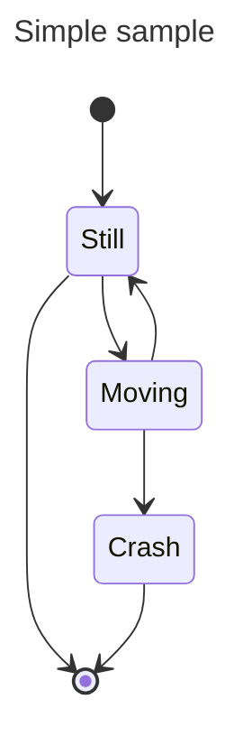

_PDF Document Maker_ is a comprehensive tool for producing good quality PDFs from Markdown or AsciiDoc files.

Under the covers it uses a full-featured static HTML processing system, AkashaCMS, that's designed for producing websites and E-Books.  The HTML is then converted to PDF using Puppeteer.  These capabilities are bundled into an easy-to-use command-line utility with a long list of options.

# Installation and Project setup for PDF Document Maker

PDF Document Maker runs on the Node.js platform, and is tested with Node.js v20.  It should work for later releases.

A project directory consists of a _package.json_ file which is used for listing dependencies and build processes.  Instead of being used for building Node.js packages, we will use it to record project dependencies and for build scripts.

```shell
$ node --version  # Make sure v20 or later
$ npm init -y     # Set up a default package.json
$ npm install pdf-document-maker --save
```

Once installed you can get help:

```shell
$ npx pdf-document-maker --help
TODO capture current help output
```

The application has a lot of options.  But, most of them have reasonable defaults, and typically you'll use only a few.

# Quick start for using PDF Document Maker

Before going deep into using PDF Document Maker, let's do a quick and easy example.  We will format a test file into a PDF.

The search phrase "_standard markdown test file_" turns up several test Markdown files.  This repository has a very good one:   https://github.com/mxstbr/markdown-test-file

Start by creating a directory, adding a `package.json`, and installing `pdf-document-maker` as shown above.

The GitHub repository for this tool already has this set up in https://github.com/akashacms/pdf-document-construction-set/tree/main/example/simple

In that directory, create a directory named `documents`:

```shell
$ mkdir documents
$ cd documents
$ wget https://...   # Download TEST.md
$ cd ..
```

With a file, `documents/TEST.md`, run this command:

```shell
$ npx pdf-document-maker  \
        --document-dir documents \
        --pdf-output PDF \
        --html-output out \
        --title 'Markdown test document' \
        --format A4 \
        TEST.md
```

This command creates two files:

* `out/TEST.html` - is the HTML intermediate file
* `PDF/TEST.pdf` - is the PDF result

## What did that command do?

A lot happened under the covers:

* A configuration object was built for rendering documents into an HTML output directory.
* The input file was processed and written to the output, as were any assets (CSS etc).
    * This created `out/TEST.html`
* Puppeteer was invoked to print the HTML to PDF.
    * This created `PDF/TEST.pdf`

The directory _documents_ is declared as a place the tool looks for documents.  There can be more than one documents directory.  The underlying system, AkashaCMS, supports four sets of input directories, _assets_, _partials_, _layouts_, and _documents_.

| Type        | Option           | Description |
|-------------|------------------|-------------|
| _assets_    | `--asset-dir`    | Holds unprocessed files like CSS or images |
| _partials_  | `--partial-dir`  | Holds templates for content snippets   |
| _layouts_   | `--layout-dir`   | Holds page layout templates            |
| _documents_ | `--document-dir` | Holds document files                 |

For of the directory types there may be multiple actual directories.  The directories are _stacked_ with the later directories being higher in the stack.  This forms four virtual filesystems and we refer to files using the relative pathname from the root.

In this example there is one documents directory.  The file `documents/TEST.md` has a VPath (Virtual Path) of `TEST.md` which is the path we use on the command line.

There is a default layout directory within PDF Document Maker holding a single layout template, `default.njk`.  If no layout template is specified, that one is used.

# File name conventions

We already discussed how the virtual directory stack works, and that a VPath are path names relative o the root directory(ies).

_Documents_ directories file names have file extensions naming the file type, as is usual practice.  The extension is used to select the rendering package required to process that file.

Name | Extension | Output Ext | Description
-----|-----------|-------------|-------------
AsciiDoc | `.adoc` or `.html.adoc` | `.html` | Supports AsciiDoctor documents
Markdown | `.md` or `.html.md`   | `.html` | Supports Markdown documents
LESS     | `.less` or `.css.less`  | `.css` | Supports compiling LESS files to CSS
EJS      | `.ejs` or `.html.ejs`  | `.html` | EJS
Handlebars | `.handlebars` or `.html.handlebars` | `.html` | Handlebars
JSON     | `.json` or `.html.json` | `.html` | Supports rendering a JSON document through a template to produce HTML
Liquid   | `.liquid` or `.html.liquid` | `.html` | LiquidJS
Nunjucks | `.njk` or `.html.njk`  | `.html` | Nunjucks

In documents directories, files with these extensions are processed by the named rendering engine, then placed in the same VPath (with the new extension) in the HTML output directory.

In partials or layouts directories, files have either extension, and are used while rendering files in the documents directories.  These files are not copied to the HTML output directory.

In assets directories, files are simply copied to the HTML output directory.

# Page layouts

One way PDF Document Maker differs from other Markdown-PDF tools is by supporting the use of a layout template.  Layout templates are responsible for establishing the entire page structure.

The HTML resulting from rendering the Markdown or AsciiDoc is available to the layout template as a variable named _content_.

Consider the default layout template, `default.njk`:

```html
<!doctype html>
<html lang="en">
<head>
<meta charset="utf-8" />
<meta http-equiv="X-UA-Compatible" content="IE=edge,chrome=1" />
<meta name="viewport" content="width=device-width, initial-scale=1.0"/>




<title>{{ title }}</title>
{{ ak_core.stylesheets() }}
{{ ak_core.headerJavaScript() }}
</head>
<body>
<div class="container-fluid" role="main">
<div class="row">
  <!-- include our document's content -->
  <article class="col-md-9">
      {{ content }}
  </article>
</div>
{{ ak_core.footerJavaScript() }}
</body>
</html>
```

This template is derived from ones used for regular websites.  It is in Nunjucks format.

It imports Nunjucks macros from the AkashaCMS _built-in_ and _base_ plugins.  The PDF Document Maker tool is built using AkashaCMS components, which cover a broad range of website or EBook building needs.

In this case we see that lists of CSS stylesheets and JavaScript files can be included in the top of the document (`<head>`) or the bottom of the document.  That's handled by calling a couple functions in the _built-in_ plugin.

Bootstrap classes are used to aid page layout, but can be used for other purposes.

As said earlier, the content from the previous rendering stage is available as the variable _content_. The page title is also available as a variable.

## Partial templates

Partials are typically a small template meant to help format commonly used HTML structures.

For example, each document might have a metadata field (we'll discuss this later) named `publicationDate` which you might want to present somewhere.  In the AkashaCMS Base plugin, the partial `ak_publdate.html.njk` is available for this purpose (in NJK format):

```html

    Date: {{ publicationDate | escape }}

```

This can be invoked by the custom tag

```html
<partial file-name="ak_publdate.html.njk" data-publication-date="Date String"/>
```

There are other methods such as the `<publication-date>` tag, or the `akpublicationdate` extension installed in Nunjucks, both of which invoke this same partial template.

# Document format, and document metadata

We've already discussed three items that are contained in document metadata.

Like many systems, the document format supports YAML frontmatter which turns into the document metadata.

It looks roughly like this:

```yaml
---
title: Gettysburg Address
layout: page.html.ejs
publicationDate: January 7, 2025
otherTag: otherValue
tag42: "The Meaning of Life"
---
This is the content area.
```

The area reading _this is the content area_ is the content body for the document.  The part between the lines of three dashes (`---`) is the frontmatter, and must be in YAML format.

When a document is read, it is first parsed into _body_ (or sometimes _docContent_) and _metadata_ (or sometimes _docMetadata_).

The metadata object is available, as discussed earlier, to templates as "_variables_".  The NJK template snippet, `{{ publicationDate | escape }}`, means to access the metadata variable `publicationDate` and then apply the `escape` filter.

## Default metadata values in PDF Document Maker

As a convenience, PDF Document Maker supports command-line options for two metadata values:

* `--title` supplies the value for `title`, and overrides any existing value
* `--layout` supplies the value for `layout`, and overrides any existing value

## The meaning for certain metadata values

Generally the content metadata is simply data with no other defined purpose.  It is up to the templates used for processing your documents define the purpose of each metadata value.

Some fields do have defined purposes:

* `title` serves as the page title, and might be used in the `<title>` tag as well as in a prominent `<h1>` tag at the top of the page.
* `layout` names the layout template to use with this document.
* `publicationDate` is a date string (it will be parsed by the Date class) on which the document was _published_.

# CSS styles for print

Most of us use CSS for theming web pages shown in a web browser.  We'll create a CSS stylesheet, include it in our web page, and not at all care about the `@media` tag in CSS.

Using `@media` we can target some of our CSS declarations for `screen` display:

```css
@media screen and (min-width: 900px) {
    /* ... */
}
```

This targets regular display screens at least 900px wide.

We might not be aware of the need for specific CSS rules to handle printing.  Printed output has different requirements than screen display.  To produce a good quality PDF/print document we must take this into account.  Doing so starts with this:

```css
@media print {
    /* All your print styles go here */
}
```

What you do is up to you.

To specify a stylesheet:

```
--style <cssFile>     File name of CSS style sheet
```

This filename is a VPath within the HTML output directory.  The CSS file can be stored in an asset directory.

You may prefer to use the LESSCSS format.  In that case the file should be stored in a document directory and have an extension of either `.less` or `.css.less`.  Such a file will be processed into a file with the `.css` extension in the output directory.

Whether the files are in an assets or documents directory, the `--style` option is still required in order for the stylesheet to be referenced.

Here are links to articles that are useful for understanding CSS for printing:

* https://www.sitepoint.com/css-printer-friendly-pages/
* https://didoesdigital.com/blog/print-styles/
* https://www.makeuseof.com/format-web-page-for-printer/
* https://www.smashingmagazine.com/2015/01/designing-for-print-with-css/

Support for https://printedcss.com/ is bundled in PDF Document Maker.  It is automatically included in the stylesheet declarations.

If you prefer to disable this, use the `--no-printcss` option.

Some other frameworks for CSS for printing:

* https://github.com/BafS/Gutenberg
* https://github.com/vladocar/Hartija---CSS-Print-Framework?tab=readme-ov-file
* https://github.com/cognitom/paper-css
* https://www.getpapercss.com/

For example to use Gutenberg, start by adding it to your project dependencies:

```shell
$ npm install gutenberg-css --save
```

Then create an asset directory:

```shell
$ mkdir -p assets/vendor/gutenberg
```

Then copy the Gutenberg CSS into that directory:

```shell
$ cp -r node_modules/gutenberg-css/dist/ assets/vendor/gutenberg/
```

And finally, when running PDF Document Maker we add `--style vendor/gutenberg/dist/gutenberg.css`

```shell
$ npx pdf-document-maker  \
        --document-dir documents \
        --pdf-output PDF \
        --html-output out \
        --title 'Markdown test document' \
        --style vendor/gutenberg/dist/gutenberg.css \
        --format A4 \
        TEST.md
```

# Project configuration with the PDF Document Maker CLI

We discussed earlier that a PDF Document Maker project directory contains the Node.js `package.json` file where one dependency is `pdf-document-maker`.  The directory must also contain the sort of files mentioned earlier.

Most of the project configuration is handled with command-line options.  The `--help` option will show you the full list of options.

The configuration options cover two broad areas:

* Generating HTML from the input files - These options control generation of the AkashaCMS configuration object
* Generating PDF from the HTML - These options control the Puppeteer configuration

TODO go over the options in groups

# Project configuration with AkashaCMS configuration files

Under the covers, PDF Document Maker creates an AkashaCMS configuration file.  This file instructs AkashaCMS components on where to find input files, and customizations for generating HTML and other files.

One learns about this configuration file at https://akashacms.com  There is an example file in the repository.

For most projects using the command-line to auto-generate a configuration object is sufficient.  But, some projects may want more control than we can expose with command-line options.

Once you have a config file, add `--config configFN` to the options.

# Drawing diagrams with `draw.io`, PlantUML or Mermaid

There are many tools for creating images of all kinds.  Images feed our need to have a visual view counterpoint to the text in our documents.

There are three tools we can focus on that are of use to typical software engineers.

## Using `draw.io` diagrams in PDF Document Maker

The first, `draw.io`, is a diagramming tool with built-in clip art useful for software engineering, hardware deployment, and other technical diagrams.  It is very easy to use, and with it one can quickly create complex diagrams.

To learn about the application, visit https://www.drawio.com/

To use it online, visit https://draw.io

There is an open-source desktop application, where the GitHub repository is at: https://github.com/jgraph/drawio-desktop  However, on `drawio.com` there is a download link going back to the GitHub repository.  And, the desktop application may be available via package management systems.  On Linux, it is available via Flathub.

Once you've drawn an image, the best way to proceed is to save the drawing as PNG.


On this screen you choose the export options.


The "_include a copy of my diagram_" ensures that the PNG can be edited by `draw.io` in the future.  That is, the resulting PNG has information about the drawing such that `draw.io` can recreate the editing experience.

The diagram is easy to include in Markdown using the normal image tag.

```

```

Which results in the following:


If in the future you need to edit the diagram, simply load the PNG file back into `draw.io`.  When done editing the file make sure to save it using the same procedure.

## Using PlantUML diagrams in PDF Document Maker

PlantUML - https://plantuml.com/ - is a versatile tool for creating a number of diagrams useful in software engineering and related fields.  As the name suggests it focuses mostly on UML diagrams.

With PlantUML you create a textual description of the diagram to create.  The description is placed inline with the Markdown file.  When the document is rendered to HTML, the description is converted to an SVG representation of the description.

The conversion can be disabled by using the `--no-md-plantuml` option.

A sample diagram looks like this:

```
@startuml

start

if (Graphviz installed?) then (yes)
  :process all\ndiagrams;
else (no)
  :process only
  __sequence__ and __activity__ diagrams;
endif

stop

@enduml
```

Imply insert that text in the Markdown file.  The default delimiters are `@startuml` and `@enduml`, with everything in-between interpreted as the PlantUML diagram.

@startuml

start

if (Graphviz installed?) then (yes)
  :process all\ndiagrams;
else (no)
  :process only
  __sequence__ and __activity__ diagrams;
endif

stop

@enduml

TODO - Cover installing a local PlantUML server

## Using MermaidJS diagrams in PDF Document Maker

Mermaid - https://mermaid.js.org/ - is similar to PlantUML.  It supports a variety of diagrams, mostly in the UML bailiwick.  One creates a textual description o the diagram, pasting it into a Markdown document.

TODO: This has not been integrated as yet.

TODO: How to disable Mermaid

A sample Mermaid diagram is:

```


That is, you create a Markdown code block, where the first set of backticks is labeled with "mermaid".  In-between you enter the description of the diagram.

The result looks like so:


# Custom HTML tags and custom HTML processing

