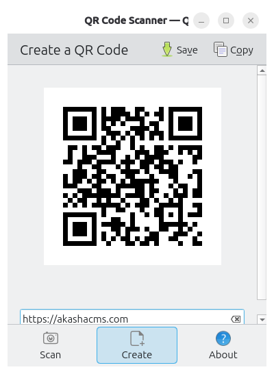

QR Codes look like this:


They are a type of "Bar Code".  The pattern of dots encodes some data, in this case the URL `https://akashacms.github.io/pdf-document-construction-set/`, the documentation site for PDF Document Maker.

QR Codes can be used for a wide variety of things, most often to make a URL available which can be scanned by a smart phone to open the desired page.  Some practical uses are:

* A restaurant menu can include a QR Code for each item, leading to a page with nutritional information
* Encoding WiFi connection credentials so folks visiting a public space, like a coffee shop, can enjoy the free WiFi
* A poster for a lost dog or cat could include a QR Code with the URL of a page through which to report a sighting that automatically collects the GPS location from the smart phone
* The packaging/box for a product could have a QR Code with the URL for the product documentation, or product registration form.
* A "free" PDF could include a QR Code leading to a donations page on, say, PayPal
* A game could be created with QR Codes taped to street sign poles which contain clues to solving a puzzle
* A formal research paper might include QR Codes in the references section linking to the source

QR Codes are easy to make, and are easy to embed in a document.

## Tasks

People are either:

* **Generating** a QR Code for whatever purpose they have
* Or, the vast majority are **Scanning** a QR Code they think contains useful data

That means one is either looking for:

* A QR Scanner application, probably for their smart phone
* Or, one is looking for a QR Creator application, probably for their laptop or desktop computer.

Some applications do both tasks.

## Generating QR Codes

There are close to a zillion websites where you can generate a QR Code for free.  But, why give your private information to a 3rd party website where you don't know what they'll do with that data?

There are many applications for smart phones or desktop computers to both generate or scan QR Codes.  For example on Linux, the application QRCA looks like this:



The overkill route is to ask your QA agent:

> generate a PNG file containing a QR code for the URL `https://akashacms.com`

Claude complained that this task was outside the scope for the repository where it was located, but since this was such a simple task it generated a temporary Python virtual environment and used a Python QR Code library to generate a file.

The QR Code shown at the top was generated by the [Node.js application `qrcode`](https://www.npmjs.com/package/qrcode) using this command line:

```shell
$ npm install qrcode --save-dev

$ npx qrcode \
            -t png \
            -o pdf-document-maker.png \
            https://akashacms.github.io/pdf-document-construction-set/
saved qrcode to: pdf-document-maker.png
```

Another approach is to use a library such as [the Node.js package `qr-code-styling`](https://www.npmjs.com/package/qr-code-styling).  This library offers a rich API enabling many stylistic flourishes in your QR Code.  They included dots with rounded corners, changing the color of the dots, and adding a branding image in the middle of the QR Code.

Using `qr-code-styling` requires writing a small Node.js program.

QR Code libraries are available for every programming language.  Look in the package management system for your language of choice to explore the options.

## QR Code formats

QR Codes can be in image files, or text files.

For example, a text form for the QR Code shown at the top is easy to generate by changing the parameters:

```shell
$ npx qrcode \
        -t utf8 \
        -o pdf-document-maker.txt \
        https://akashacms.github.io/pdf-document-construction-set/
saved qrcode to: pdf-document-maker.txt

$ cat pdf-document-maker.txt 
                                         
                                         
    █▀▀▀▀▀█ ██  ██  ▀▀█▀██ █  █▀▀▀▀▀█    
    █ ███ █ ▄█ ▄▀ ▄▄█▄▄▀▀ ▄▄  █ ███ █    
    █ ▀▀▀ █  █   ▄█    █▄ █ ▀ █ ▀▀▀ █    
    ▀▀▀▀▀▀▀ █ ▀ █ █ ▀▄▀▄▀ █ █ ▀▀▀▀▀▀▀    
    ▀ █▀▄▀▀█    ▄ ▀ ▄█▀▄██ █  █▄ █▄▀█    
     ▀▀▀██▀█▄█ ▄▀▄█▄▀▀█▄  ██▀█▄█▀█ █▀    
    ▀▄ ▄▀█▀█▀█▄▀▄   ▄█▄█  █ ██ █▀▀▄█     
    █▀█  █▀ █ █  ▄▀▀█ ▀▀▀██▄▀▄█▀▀██      
    ▄ ██ ▄▀  ▄▄▀█ ██▄ ▀▀█▀█▄███ ██▀▄▄    
    ▄▀█ ▄▄▀▀▀▀▄▄ ██████▄▀  ▄ ▀▄▀█ ▀█▄    
    ▄  ▀▀█▀█ █▄█ ▀▀█▀▀██▄▀▄▄ ▀▄  ▀█ █    
     ▄ █▀▀▀█▀█ ▄▀▄ ▄▀  ▄█ ▀█▀ ▀█ ▄▀██    
    ▀   ▀ ▀▀▄▀ ▄ ▀ ▄▄█▀▄  █▄█▀▀▀██  ▀    
    █▀▀▀▀▀█ █▄▀▄▀█ ▄  ▀█▄▄▄██ ▀ █▄▄▀▄    
    █ ███ █ ▄▀█ ▄▄ █▄▄█▀▄▀███▀▀█▀▄▀▀█    
    █ ▀▀▀ █ ▀▄▀██ █▀▄█ ▄█ ▄▄▄▄▀█▄▀▀ ▄    
    ▀▀▀▀▀▀▀ ▀▀▀     ▀▀▀▀ ▀▀▀    ▀ ▀      
```

## Embedding a QR Code in a web page

You have a QR Code application, and you've generated one or more files.

We've demonstrated including the QR Code image in a web page:

* For HTML: ``
* For Markdown: ``

There's nothing special about this.  Generate the image, place the image in your assets area, then use an image tag to cause the image to show in the web page.

## Embedding a QR Code in a PDF document

The exact process will vary based on the toolset used to generate the PDF document.  But, the general process is the same:

* Generate the QR Code
* Add the image file to the document in the word processor of choice
* Cause the word processor to regenerate the PDF file

## Embedding a QR Code in a PDF document using PDF Document Maker

In PDF Document Maker, we create a _documents_ directory, and add one or more Markdown files to that directory.

Next, we create the QR Code image file, storing it in the _documents_ directory.

In the document add `` so the QR Code appears in the document.

If you want to include the QR Code in the header or footer of every page, some special care must be taken.

* The header or footer HTML snipped must include `` referencing the QR Code image file
* The **height** of the header or footer region must be adjusted to be tall enough to accommodate the QR Code image using the `--height-header <height> ` or `--height-footer <height>` options

Try scaling the image using HTML attributes to see how well it can be read by typical QR Code scanners.

With the `qrcode` command-line Node.js tool mentioned earlier, the `--width` option sets the width of the QR Code image, and its height is a function of the scale factor between width and height.


